# Payload fork CI and release automation

## Goal

Give a junior developer a safe, repeatable path from a feature branch to a manually merged `main_v2`, then from a reviewed release-preparation commit to an automated GitHub Release.

The authoritative CI definition stays in [`.github/workflows/main.yml`](.github/workflows/main.yml) to reduce conflicts when upstream workflow changes are merged. Local scripts mirror the useful laptop-sized subset and explicitly document that they are not the CI source of truth.

## Scope

### Must-have (Stage 0)

- Run the inherited CI graph for pull requests targeting `main_v2` and pushes to `main_v2`.
- Keep merges manual and require one stable aggregate CI check.
- Add `pnpm verify` for frequent local checks and `pnpm verify:full` for built-output E2E checks.
- Make the full E2E path load Payload from `packages/payload/dist`, not `packages/payload/src`.
- Add a release check for tag, package version, changelog, release note, commit, branch ancestry, and clean-tree alignment.
- Publish `payload@<semver>` tags as GitHub Releases with `payload-<semver>.tgz` and `payload.tgz`.
- Remove obsolete community-management and old release workflows, including their orphaned local actions.
- Stop using `release_v2` after a successful cutover release.
- Document the implemented workflow and preserve all unrelated working-tree changes.

### Next iteration

- Add a release-preparation bot or generated release pull request.
- Add a temporary consumer-install smoke test for the packed tarball.
- Add a merge queue if concurrent pull requests become common.

### Later

- Publish to npm or another registry.
- Release additional workspace packages.
- Support prerelease tags and channels.
- Enable automatic merges.

## Locked decisions

- CI triggers only for pull requests targeting `main_v2` and pushes to `main_v2`. Feature branches use local verification before a pull request.
- The workflow remains the CI source of truth. It does not call `pnpm verify`.
- `pnpm verify` excludes E2E. `pnpm verify:full` includes E2E against built Payload output.
- Tags use `payload@<stable-semver>`, for example `payload@2.132.5`.
- Release prose lives at `releases/<tag>.md` and becomes the GitHub Release body without generated prose.
- GitHub Release assets include an immutable versioned name and the stable name `payload.tgz`.
- No new package dependencies are required.

## End-to-end flow

```mermaid
flowchart LR
  featureBranch[FeatureBranch] --> localVerify[LocalVerify]
  localVerify --> pullRequest[PullRequestToMainV2]
  pullRequest --> ciGate[GitHubCIGate]
  ciGate --> manualMerge[ManualMerge]
  manualMerge --> releasePrep[ReleasePrepPR]
  releasePrep --> mainGreen[GreenMainV2Commit]
  mainGreen --> localTag[AnnotatedPayloadTag]
  localTag --> releaseCheck[ReleaseCheck]
  releaseCheck --> tagPush[PushTag]
  tagPush --> releaseWorkflow[ReleaseWorkflow]
  releaseWorkflow --> githubRelease[GitHubReleaseAndDualAssets]
```

## Files and ownership

### Modify

- [`package.json`](package.json) - add `verify`, `verify:full`, `test:e2e:dist`, `test:tooling`, and `release:check` scripts; make the lint command cover `.ts` and `.tsx`.
- [`.github/workflows/main.yml`](.github/workflows/main.yml) - retarget triggers, add lint, run dist-mode E2E, broaden relevant path filters, and add one aggregate gate job.
- [`test/buildConfigWithDefaults.ts`](test/buildConfigWithDefaults.ts) - select `src` or `dist` paths for Payload runtime, Admin entry, and Payload mocks.
- [`test/runE2E.ts`](test/runE2E.ts) - fail early when dist mode is requested without a completed build and preserve existing sharding.
- [`README.md`](README.md) - describe `main_v2`, tag-based releases, and stable/versioned download links; remove `release_v2` as an active release branch.
- [`AGENTS.md`](AGENTS.md) - replace the release-branch note with the tag and GitHub Release contract.
- [`.agents/docs/README.md`](.agents/docs/README.md) - link the release-process orientation document.
- [`.agents/docs/local-development.md`](.agents/docs/local-development.md) - document both verification commands and state that `main.yml` is authoritative.
- [`.agents/docs/terminology.md`](.agents/docs/terminology.md) - add canonical terms for branch verification and the release check; mark `release_v2` as deprecated without deleting its history.

### Create

- [`.github/workflows/release.yml`](.github/workflows/release.yml) - validate and publish tags.
- [`scripts/checkRelease.ts`](scripts/checkRelease.ts) - one CLI entry point containing the release validation logic.
- [`scripts/checkRelease.spec.ts`](scripts/checkRelease.spec.ts) - release-check regression tests.
- [`test/helpers/registerDistPayload.cjs`](test/helpers/registerDistPayload.cjs) - preload hook that maps core Payload source imports to matching built files only during dist E2E.
- [`test/helpers/registerDistPayload.spec.ts`](test/helpers/registerDistPayload.spec.ts) - isolated resolver regression tests.
- [`releases/README.md`](releases/README.md) - exact naming, prose template, and manual release-preparation procedure.
- [`.agents/docs/release-process.md`](.agents/docs/release-process.md) - thin orientation map for the shipped release boundary and key files.

### Delete

- `.github/workflows/post-release.yml`
- `.github/workflows/release-canary.yml`
- `.github/workflows/stale.yml`
- `.github/workflows/label-on-change.yml`
- `.github/workflows/triage.yml`
- `.github/workflows/lock-issues.yml`
- `.github/actions/release-commenter/`
- `.github/actions/triage/`
- `.github/pnpm-lock.yaml` and `.github/pnpm-workspace.yaml` after both local actions are removed

Keep issue templates, pull-request templates, CODEOWNERS, Dependabot configuration, and unrelated `.github` content unchanged.

## Implementation steps

### 1. Establish tests for built-output E2E selection

Use TDD before changing the E2E runner.

1. Add resolver tests that spawn a child Node process with `registerDistPayload.cjs` preloaded.
2. Assert a Payload path under `packages/payload/src` resolves to the corresponding `packages/payload/dist` file in dist mode.
3. Assert paths outside `packages/payload/src` are unchanged.
4. Assert dist mode fails clearly when the expected built file does not exist.
5. Keep the resolver narrowly scoped to the core Payload package. Do not remap database adapters, plugins, or unrelated workspaces.

The preload hook is necessary because many existing E2E suites and their imported configs use relative `packages/payload/src` imports. Rewriting every fixture would create a large upstream-conflict surface.

### 2. Add a built-output E2E mode

1. Keep existing `pnpm test:e2e` behavior available for source-level development.
2. Add `test:e2e:dist` that first builds Payload, sets a clear environment flag such as `PAYLOAD_TEST_RUNTIME=dist`, preloads the narrow resolver, then runs the existing E2E command.
3. Update `buildConfigWithDefaults.ts` so path strings passed to Webpack also select `dist/admin` and built Payload mocks. A require hook cannot rewrite ordinary path strings.
4. Make `runE2E.ts` check for `packages/payload/dist/index.js` before starting a dist run.
5. Run one small E2E suite as a tracer first. Then run the complete unsharded local suite and the existing CI shards.
6. Prove the dist path is active in a tooling test. A successful build followed by source-based E2E is not sufficient.

This mode still uses the existing test server and development middleware. Its contract is narrower: server and Admin modules must resolve from `packages/payload/dist`. Converting the harness to production static hosting is out of scope.

If the preload approach cannot support the tracer suite, stop this slice. Replace it with one shared test-runtime adapter and explicit E2E imports. Do not add broad source rewriting or copy test trees.

### 3. Add local branch verification scripts

Add root scripts without changing the workflow into a wrapper:

- `verify`: lint, build Payload, run MongoDB integration tests, run component tests, and run tooling tests.
- `verify:full`: run `verify`, then run the complete dist-mode E2E suite.
- `test:tooling`: run only `scripts/checkRelease.spec.ts` and `test/helpers/registerDistPayload.spec.ts` by explicit path with the existing Jest/SWC setup.

Document next to the commands in `local-development.md` that:

- `main.yml` is authoritative.
- `verify` is the frequent local subset.
- `verify:full` is the local pre-PR or pre-release check when time and browser dependencies permit.
- Changes to CI criteria require an explicit local-script parity review.

Do not add an install step to either verification script. Installation remains an explicit setup operation.

### 4. Retarget and strengthen the inherited CI workflow

Preserve the current job graph and upstream-friendly structure.

1. Limit `pull_request` to base branch `main_v2` and keep `opened`, `reopened`, and `synchronize`.
2. Change the push branch from `main` to `main_v2`.
3. Add `scripts/**` and all workflow files to the path filter that decides whether build verification is needed.
4. Baseline the existing `.ts` lint and a `.ts` plus `.tsx` lint before changing the gate. Expand the root lint glob to both extensions. Treat pre-existing TSX failures as a visible blocker instead of weakening the new gate.
5. Run `pnpm lint` in the build job before `pnpm build`.
6. Keep the current five-database integration matrix, component tests, eight E2E shards, code-generation smoke jobs, package/plugin builds, and conditional template builds.
7. Change only the E2E command to use dist mode while retaining sharding, retries, and artifacts.
8. Keep the generation jobs as execution smoke checks. They do not currently assert a clean generated-file diff.
9. Add an `if: always()` aggregate job, named stably such as `CI gate`, which depends on every job. It must fail for any failed or cancelled required job and accept intentionally skipped path-filtered jobs.
10. Require only this stable aggregate job in repository rules. Do not require every matrix child individually.
11. Use `pull_request`, not `pull_request_target`, so fork pull requests receive no secrets and only a read-only token.

Do not silently modernize action versions, databases, package managers in templates, or the current test matrix. Those are separate maintenance work.

### 5. Implement the release check with TDD

The CLI command is `pnpm release:check -- payload@<version>`.

Write failing tests before implementation for these cases:

- A valid annotated or lightweight tag at `HEAD`, matching package version, changelog, note, clean tree, and `main_v2` ancestry passes.
- A malformed tag or prerelease tag fails.
- A missing tag, a tag not at `HEAD`, or a tag outside `main_v2` fails.
- A package-version mismatch fails.
- A missing, empty, or whitespace-only `releases/<tag>.md` fails.
- A missing current-version heading near the top of `CHANGELOG.md` fails.
- A dirty working tree fails.
- Shell-significant tag text cannot escape into a command.

Implementation rules:

- Parse the exact tag pattern `payload@<stable-semver>`.
- Read the version from `packages/payload/package.json`.
- Resolve tags and commits with argument-safe child-process calls, not interpolated shell strings.
- Require the tag to resolve to `HEAD`.
- Require the tag commit to be an ancestor of local `main_v2` or fetched `origin/main_v2`.
- Keep validation in the same module as the CLI. Do not add a one-use helper module.
- Print one actionable error per failed invariant and return a nonzero exit status.

### 6. Define the manual release-preparation contract

Record this procedure in `releases/README.md`:

1. Start a release-preparation branch from a green `main_v2`.
2. Run `pnpm -C packages/payload version patch --no-git-tag-version`, or use `minor` when intended.
3. Update the matching top section in `CHANGELOG.md`.
4. Create `releases/payload@<version>.md` with reviewed GitHub Release prose and predictable stable/versioned download links.
5. Commit the package version, changelog, and release note together.
6. Open a pull request to `main_v2`, wait for `CI gate`, and merge manually.
7. Pull the resulting green `main_v2` commit.
8. Create an annotated tag: `git tag -a payload@<version> -m "Payload <version>"`.
9. Run `pnpm release:check -- payload@<version>`.
10. Push the tag only after the check passes.

Do not let `pnpm version` create an early commit or tag. The reviewed release commit must contain the version, changelog, and release note together.

### 7. Add the tag-triggered release workflow

Implement `release.yml` with these controls:

1. Trigger only on pushed tags matching `payload@*`.
2. Use a per-tag concurrency group with cancellation disabled.
3. Grant only `contents: write` and `actions: read` to the release job.
4. Check out the exact tag with full history and fetch `origin/main_v2` explicitly.
5. Dereference an annotated tag to its commit with `git rev-parse "${GITHUB_REF_NAME}^{commit}"` before the ancestry check.
6. Install with pnpm 9.7.0 and a frozen lockfile, matching repository policy.
7. Run the shared release check against `GITHUB_REF_NAME`.
8. Query GitHub Actions and require a successful `main.yml` push run for the tagged commit. If CI is pending or absent, fail without publishing and instruct the operator to rerun after CI is green.
9. Run `pnpm build` from the root.
10. Run `pnpm -C packages/payload pack --pack-destination <runner-temp-dir>`.
11. Require exactly one archive with the expected name `payload-<version>.tgz`.
12. Copy the same bytes to `payload.tgz` and verify equal SHA-256 hashes.
13. Create a draft GitHub Release from `releases/<tag>.md` using the runner-provided GitHub CLI and `--verify-tag`.
14. Attach both archives, then publish the draft and mark the stable release as latest.
15. Fail if a published release already exists for the tag. Document deletion of an incomplete draft before a manual rerun rather than overwriting an immutable published asset.

Use the GitHub-hosted `gh` binary. Do not add a release action or install a local GitHub CLI dependency.

Expected stable link:

`https://github.com/abernh/payload/releases/latest/download/payload.tgz`

Expected pinned link:

`https://github.com/abernh/payload/releases/download/payload@<version>/payload-<version>.tgz`

### 8. Remove obsolete automation and retire `release_v2`

1. Delete the six obsolete workflow files listed above.
2. Delete the two local actions and their now-orphaned `.github` pnpm workspace files.
3. Keep tarballs and `dist` ignored on `main_v2`. Do not copy old release-branch artifacts into development history.
4. Update repository and agent documentation to describe tags and GitHub Release assets as the release boundary.
5. After the first successful new-style release, inspect `git log main_v2..origin/release_v2` and confirm its six branch-only commits contain only the intentionally obsolete release artifacts and branch configuration.
6. Preserve the existing `payload@2.132.4` tag. The new ancestry rule applies to future tags and must not rewrite that historical tag.
7. Delete the remote and local `release_v2` branches only after explicit human confirmation at execution time.

### 9. Configure GitHub repository rules

After the updated workflow has produced its first `CI gate` check:

1. Confirm `main_v2` remains the default branch.
2. Add a branch ruleset for `main_v2` that requires a pull request and the `CI gate` status check.
3. Require the pull-request branch to be current with `main_v2` before merge.
4. Do not require an approval count for this solo-maintainer fork, because an author cannot approve their own pull request.
5. Block force pushes and branch deletion.
6. Keep auto-merge disabled so the final merge remains manual.
7. Keep GitHub Actions token permissions read-only by default. The release job receives its narrow write permission in `release.yml`.

Reference: [GitHub workflow syntax](https://docs.github.com/en/actions/reference/workflows-and-actions/workflow-syntax), [repository rulesets](https://docs.github.com/en/repositories/configuring-branches-and-merges-in-your-repository/managing-rulesets/creating-rulesets-for-a-repository), and [`gh release create`](https://cli.github.com/manual/gh_release_create).

## Verification and acceptance

1. Run `pnpm test:tooling` and confirm every negative release invariant is covered.
2. Run `pnpm verify` from a feature branch.
3. Run `pnpm verify:full` and prove the E2E runtime resolves Payload core and Admin paths under `dist`.
4. Open the implementation pull request to `main_v2`; confirm the existing matrix runs and the single `CI gate` reports success.
5. Run a local build and pack into a temporary ignored directory; inspect that the expected versioned archive is the only pack output.
6. Confirm no `dist` files or `.tgz` files are staged.
7. Do not create a test GitHub Release. Validate `release.yml` statically and exercise it on the next intentional `payload@<version>` release.
8. On that first release, confirm the Markdown body is exact, both assets download, both hashes match, and the `/releases/latest/download/payload.tgz` URL resolves.

## Existing-work protection

Before implementation, record and preserve the current unrelated changes in:

- `packages/payload/package.json`
- `pnpm-lock.yaml`
- `packages/payload/src/admin/components/views/Version/RenderFieldsToDiff/fields/Text/collapseUnchangedContent.spec.tsx`

Do not revert, reformat, stage, or absorb those changes into this work.

## Orchestration

- Mode: sequential implementation. The CI workflow, root scripts, E2E runtime, and release checks overlap too much for parallel writers.
- Owner: one implementer follows the steps in order with TDD for the resolver and release checker.
- Wave 1: built-output E2E tracer and local verification scripts.
- Wave 2: CI retargeting and aggregate gate.
- Wave 3: release checker, release workflow, and release documentation.
- Wave 4: obsolete automation removal, repository-rule setup, and final review.
- Gate after each wave: run the touched tooling tests, inspect the diff for upstream-conflict surface, and keep unrelated worktree files unchanged.
- Final gate: `pnpm verify`, `pnpm verify:full`, workflow review, and the implementation PR’s `CI gate`.
- No new dependencies. Do not run any dependency install beyond the repository’s existing `pnpm install --frozen-lockfile` CI setup.